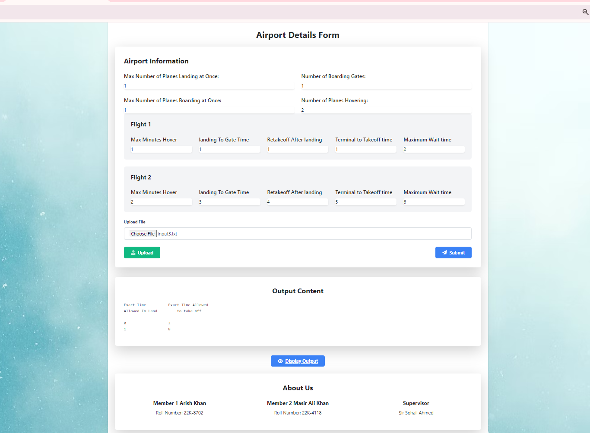

# Airport Scheduling System

This is a Flask-based web application for managing airport scheduling. It allows users to upload a file containing flight and airport information, submit a form with airport details, and displays the output content.

## Features

- Upload file: Users can upload a file containing flight and airport information.
- Submit form: Users can fill out a form with airport details and submit it.
- Display output: Users can view the output content generated by the application.

## Technologies Used

- Python
- Flask
- HTML
- CSS (Tailwind CSS)
- JavaScript

## Usage

1. Clone the repository:

   ```bash
   git clone [https://github.com/MasirAliKhan/airport-scheduling-system](https://github.com/MasirAliKhan/Airport-Scheduling-Problem-master).git
   ```

2. Install dependencies:

   ```bash
   pip install -r requirements.txt
   ```

3. Run the application:

   ```bash
   python app.py
   ```

4. Access the application in your web browser at `http://localhost:5000`.

## Screenshots




## Authors

- Arish Khan - [GitHub](https://github.com/arishkhan/)
- Masir Ali Khan - [GitHub](https://github.com/MasirAliKhan/)
- Muhammad Taha Mustafa  - [GitHub](https://github.com/MuhammadTahaMustafa-06/)

## License

This project is licensed under the MIT License - see the [LICENSE](LICENSE) file for details.

---

Make sure to replace `your-username` in the clone URL with your GitHub username and update the screenshots accordingly. Additionally, customize the license section according to your preferences.
